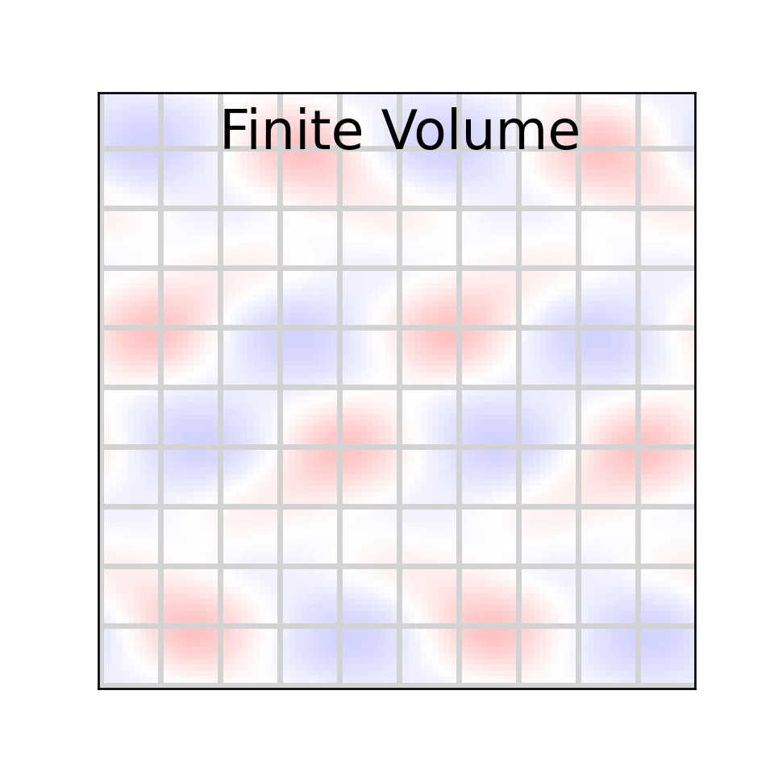
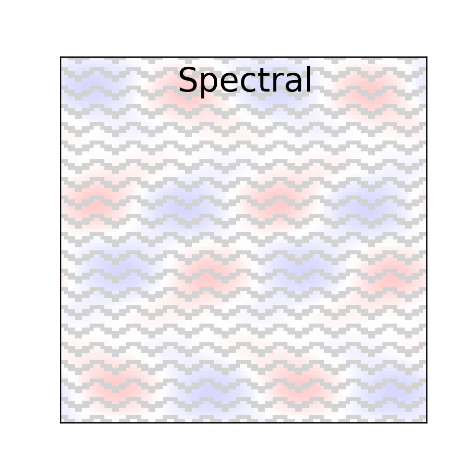
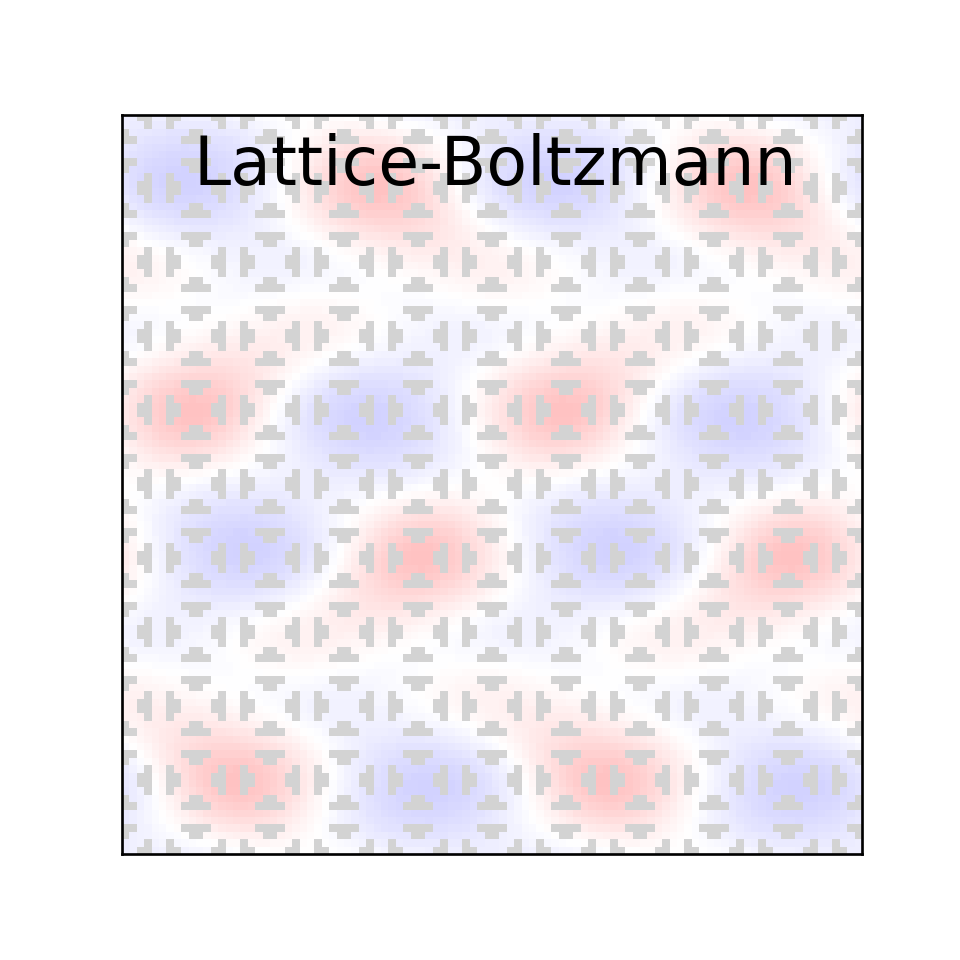
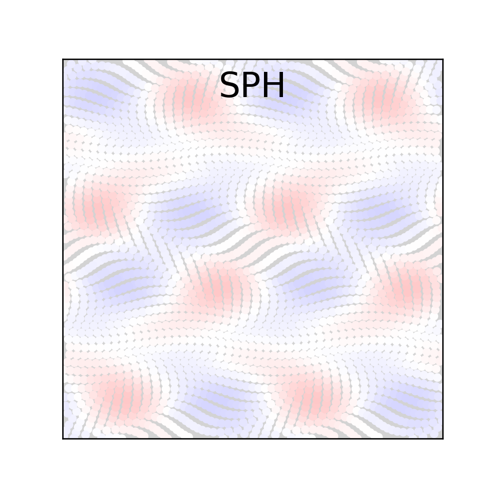

# cfd-comparison-python
Comparison of various numerical methods for computational fluid dynamics. You are encouraged to add your own or improve the schemes below!

## Create Your Own Computational Fluid Dynamics Simulations (With Python)

### Philip Mocz (2023),  [@PMocz](https://twitter.com/PMocz) 👈 Follow me for more!

Simulate the isothermal compressible Euler equations with:

1. [Finite Volume Method](https://levelup.gitconnected.com/create-your-own-finite-volume-fluid-simulation-with-python-8f9eab0b8305)


```
python finitevolume.py
```



2. [Spectral Method](https://levelup.gitconnected.com/create-your-own-navier-stokes-spectral-method-fluid-simulation-with-python-3f37405524f4)

```
python spectral.py
```



3. [Lattice Boltzmann](https://medium.com/swlh/create-your-own-lattice-boltzmann-simulation-with-python-8759e8b53b1c)

```
python latticeboltzmann.py
```



4. [Smoothed-Particle-Hydrodynamics](https://philip-mocz.medium.com/create-your-own-smoothed-particle-hydrodynamics-simulation-with-python-76e1cec505f1)

```
python latticeboltzmann.py
```



